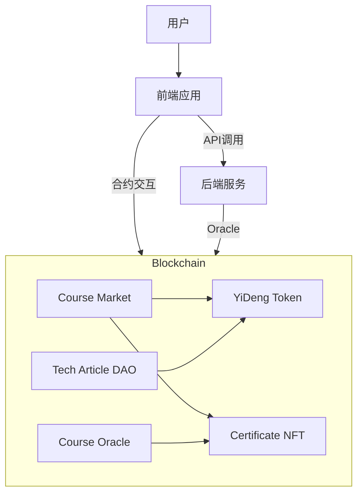

# 系统架构设计

## 整体架构



## 系统组件

### 1. 智能合约层

#### 1.1 YiDengToken (YD)

- ERC20 标准代币合约
- 总供应量管理
- 代币买卖功能
- 分配机制实现

#### 1.2 CourseMarket

- 课程管理
- 支付处理
- 购买记录追踪
- 证书发放触发

#### 1.3 CourseCertificate

- ERC721 标准 NFT 合约
- 证书铸造与管理
- 证书验证功能
- 元数据存储

#### 1.4 TechArticleDAO

- 文章提交管理
- 社区投票系统
- 奖励分配机制
- 治理功能实现

#### 1.5 AutomatedCourseOracle

- Chainlink 预言机集成
- 自动化进度检查
- 证书自动发放
- 异常处理机制

### 2. 链下服务层

#### 2.1 后端服务

- API 接口提供
- 数据处理和存储
- 用户认证和授权
- 进度追踪服务

#### 2.2 预言机服务

- 链下数据获取
- 进度验证逻辑
- 数据上链处理
- 自动化任务调度

### 3. 前端应用层

#### 3.1 用户界面

- 课程浏览和购买
- 学习进度展示
- 证书管理
- 社区互动

#### 3.2 Web3 集成

- 钱包连接
- 合约交互
- 交易处理
- 状态同步

## 数据流

### 1. 课程购买流程

```mermaid
sequenceDiagram
    参与者 User as 用户
    参与者 Frontend as 前端
    参与者 Market as 课程市场
    参与者 YD as YD代币

    User->>Frontend: 选择课程
    Frontend->>Market: 获取课程信息
    User->>Frontend: 确认购买
    Frontend->>YD: 授权代币
    YD-->>Market: 确认授权
    Market->>YD: 转账支付
    Market-->>Frontend: 购买成功
    Frontend-->>User: 显示结果
```

### 2. 证书发放流程

```mermaid
sequenceDiagram
    参与者 Oracle as 预言机
    参与者 Backend as 后端
    参与者 Market as 课程市场
    参与者 NFT as 证书NFT

    Oracle->>Backend: 检查进度
    Backend-->>Oracle: 返回状态
    Oracle->>Market: 确认完成
    Market->>NFT: 铸造证书
    NFT-->>Market: 铸造成功
```

## 安全架构

### 1. 访问控制

- 基于角色的权限管理
- 多重签名机制
- 管理员权限分离

### 2. 数据安全

- 链上数据加密
- 敏感信息保护
- 数据完整性验证

### 3. 交易安全

- 金额限制
- 冷却期设置
- 紧急暂停机制

### 4. 预言机安全

- 数据源验证
- 超时处理
- 异常检测

## 扩展性考虑

### 1. 合约升级

- 代理合约模式
- 版本控制
- 平滑升级机制

### 2. 性能优化

- 批量处理
- Gas 优化
- 缓存策略

### 3. 跨链互操作

- 跨链桥接
- 资产互通
- 状态同步

## 监控和维护

### 1. 链上监控

- 交易监控
- 事件追踪
- 异常检测

### 2. 性能监控

- Gas 消耗
- 响应时间
- 吞吐量

### 3. 运维支持

- 日志收集
- 报警机制
- 备份恢复
