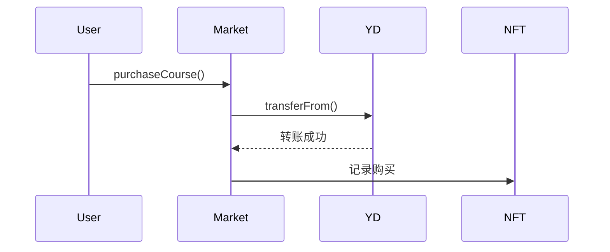
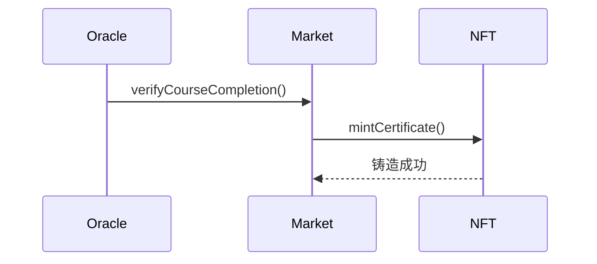

# 智能合约详细说明

## YiDengToken (YD)

### 概述

YiDengToken 是一个基于 ERC20 标准的代币合约，作为平台的核心通证。

### 关键特性

- 代币名称：YiDeng Token (YD)
- 总供应量：125 万 YD
- 精度：0（不可分割）
- 分配方案：
  - 团队: 20% (25 万 YD)
  - 市场营销: 10% (12.5 万 YD)
  - 社区: 10% (12.5 万 YD)
  - 公开销售: 60% (75 万 YD)

### 核心功能

#### 1. 代币购买

```solidity
function buyWithETH() external payable
```

- 用户可以使用 ETH 购买 YD 代币
- 兑换比率：1 ETH = 1000 YD
- 检查是否超过最大供应量

#### 2. 代币出售

```solidity
function sellTokens(uint256 tokenAmount) external
```

- 用户可以将 YD 代币卖回获取 ETH
- 按照固定比例 1:1000 计算 ETH 数量
- 检查合约 ETH 余额是否充足

#### 3. 代币分配

```solidity
function distributeInitialTokens(
    address teamWallet,
    address marketingWallet,
    address communityWallet
) external onlyOwner
```

- 初始代币分配功能
- 只能由合约所有者调用
- 确保只能分配一次

## CourseMarket

### 概述

课程市场合约，管理课程上架、购买和证书发放。

### 数据结构

```solidity
struct Course {
    string web2CourseId;   // Web2平台课程ID
    string name;           // 课程名称
    uint256 price;        // 课程价格(YD代币)
    bool isActive;        // 课程状态
    address creator;      // 创建者地址
}
```

### 核心功能

#### 1. 课程管理

```solidity
function addCourse(
    string memory web2CourseId,
    string memory name,
    uint256 price
) external onlyOwner
```

- 添加新课程
- 设置课程价格和状态
- 记录创建者信息

#### 2. 课程购买

```solidity
function purchaseCourse(string memory web2CourseId) external
```

- 使用 YD 代币支付
- 记录购买历史
- 触发购买事件

#### 3. 完成验证

```solidity
function verifyCourseCompletion(
    address student,
    string memory web2CourseId
) external onlyOwner
```

- 验证课程完成状态
- 触发证书铸造
- 记录完成信息

## CourseCertificate

### 概述

基于 ERC721 标准的 NFT 证书合约。

### 数据结构

```solidity
struct CertificateData {
    string web2CourseId;    // Web2平台课程ID
    address student;        // 学生地址
    uint256 timestamp;     // 发放时间
    string metadataURI;    // 元数据URI
}
```

### 核心功能

#### 1. 证书铸造

```solidity
function mintCertificate(
    address student,
    string memory web2CourseId,
    string memory metadataURI
) external onlyRole(MINTER_ROLE) returns (uint256)
```

- 铸造新证书
- 记录证书数据
- 生成元数据 URI

#### 2. 证书查询

```solidity
function hasCertificate(
    address student,
    string memory web2CourseId
) public view returns (bool)
```

- 查询证书持有情况
- 验证证书真实性

## TechArticleDAO

### 概述

技术社区的 DAO 治理合约，管理文章提交和评审。

### 数据结构

```solidity
struct Article {
    uint256 id;              // 文章ID
    address author;          // 作者地址
    string title;           // 文章标题
    string contentHash;     // 内容哈希
    string courseId;        // 关联课程ID
    uint256 submissionTime; // 提交时间
    uint256 votesFor;       // 支持票数
    uint256 votesAgainst;   // 反对票数
    uint256 rewardAmount;   // 奖励金额
    ArticleStatus status;   // 文章状态
}
```

### 核心功能

#### 1. 文章提交

```solidity
function submitArticle(
    string memory title,
    string memory contentHash,
    string memory courseId
) external
```

- 提交新文章
- 记录文章信息
- 初始化评审状态

#### 2. 文章评审

```solidity
function reviewArticle(
    uint256 articleId,
    bool support,
    uint8 qualityScore
) external onlyRole(REVIEWER_ROLE)
```

- 评审者投票
- 计算质量分数
- 确定奖励金额

#### 3. 奖励发放

- 自动计算奖励金额
- 达到条件自动发放
- 记录发放历史

## AutomatedCourseOracle

### 概述

基于 Chainlink 的自动化课程进度验证预言机。

### 核心功能

#### 1. 进度检查

```solidity
function checkUpkeep(
    bytes calldata /* checkData */
) external view returns (bool upkeepNeeded, bytes memory performData)
```

- 定期检查进度
- 触发自动更新
- 处理异常情况

#### 2. 自动执行

```solidity
function performUpkeep(bytes calldata performData) external
```

- 执行进度更新
- 触发证书发放
- 记录执行结果

### 安全机制

- 基于角色的访问控制
- 时间锁定机制
- 紧急暂停功能
- 金额限制保护

## 合约间交互

### 1. 课程购买流程



### 2. 证书发放流程



## Gas 优化建议

1. 批量处理

   - 使用批量转账
   - 批量更新状态
   - 合并多次调用

2. 存储优化

   - 使用 uint8/uint16 等较小类型
   - 优化 struct 布局
   - 减少存储写入

3. 计算优化
   - 避免循环计算
   - 使用位运算
   - 缓存中间结果
