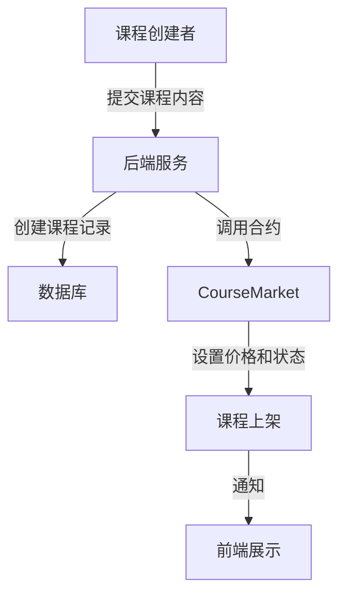
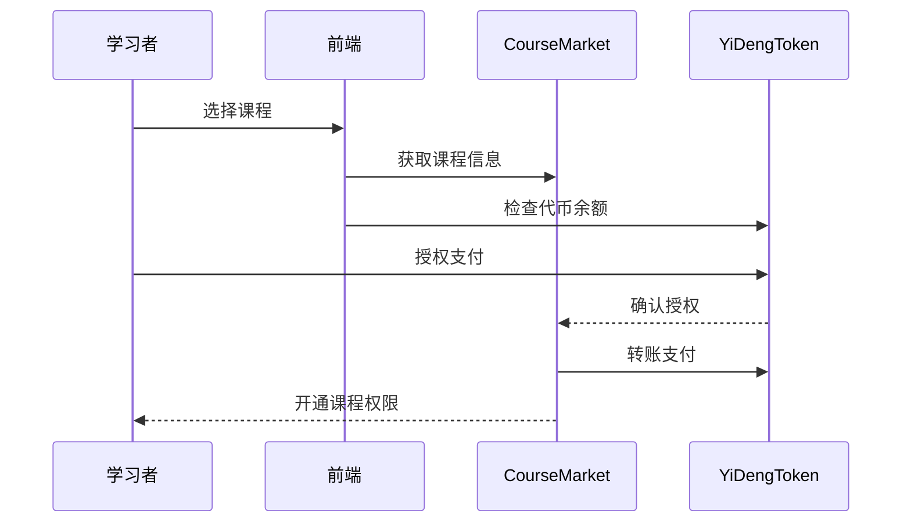
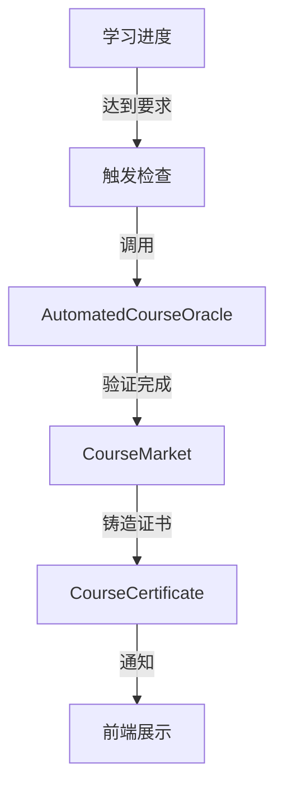
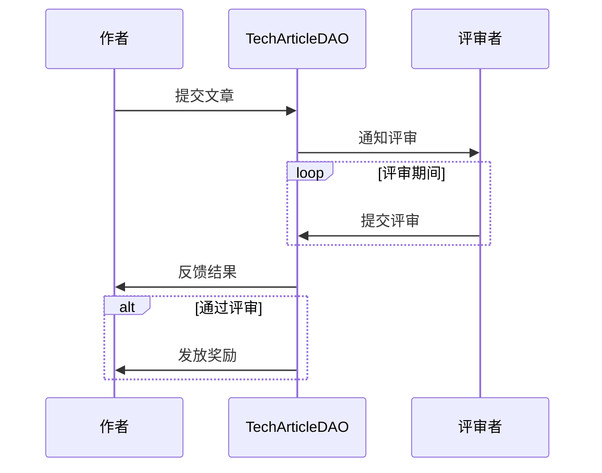
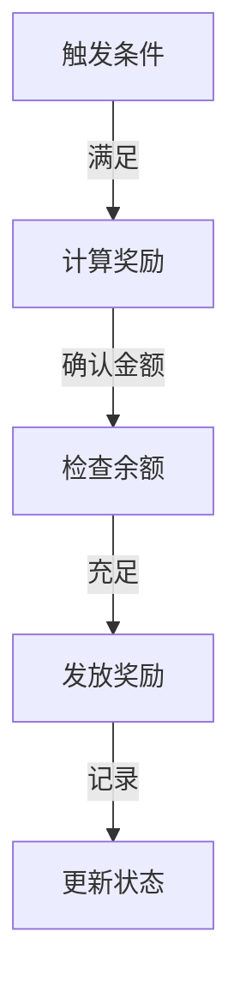

# 业务流程说明

## 用户角色

### 1. 平台管理员

- 管理课程上架
- 管理评审者
- 监控系统运行
- 处理异常情况

### 2. 课程创建者

- 创建和管理课程
- 设置课程价格
- 接收课程收益

### 3. 学习者

- 购买和学习课程
- 获取学习证书
- 参与技术社区

### 4. 评审者

- 评审技术文章
- 参与社区治理
- 维护内容质量

## 主要业务流程

### 1. 课程发布流程

#### 详细步骤

1. 课程创建者准备课程内容和材料
2. 通过管理后台提交课程信息
3. 后端验证课程信息完整性
4. 调用智能合约创建课程记录
5. 课程正式上架并展示

### 2. 课程购买流程

#### 详细步骤

1. 学习者浏览课程信息
2. 确认购买意向
3. 检查 YD 代币余额
4. 授权代币合约
5. 完成支付
6. 获得课程访问权限

### 3. 学习认证流程

#### 详细步骤

1. 系统持续追踪学习进度
2. 预言机定时检查进度
3. 确认课程完成状态
4. 触发证书铸造
5. 学习者获得 NFT 证书

### 4. 技术文章发布流程

#### 详细步骤

1. 作者提交技术文章
2. 进入评审队列
3. 评审者进行评分
4. 统计评审结果
5. 达到条件自动发放奖励

### 5. 奖励发放流程

#### 标准奖励规则

1. **文章奖励**

   - 基础奖励：100 YD
   - 质量系数：0-100%
   - 最终奖励 = 基础奖励 × 质量系数

2. **评审奖励**
   - 每次有效评审：10 YD
   - 月度优秀评审额外奖励：100 YD

### 6. 异常处理流程

#### 6.1 交易失败处理

1. 检测交易状态
2. 自动回滚操作
3. 通知相关方
4. 记录错误日志

#### 6.2 预言机异常

1. 超时检测
2. 重试机制
3. 人工介入通道
4. 应急处理方案

#### 6.3 证书发放异常

1. 验证失败记录
2. 自动重试队列
3. 管理员介入
4. 补偿机制

## 运营管理流程

### 1. 日常运营

#### 1.1 系统监控

- 合约运行状态
- Gas 费用监控
- 用户活动分析
- 异常情况报警

#### 1.2 社区管理

- 内容审核
- 用户反馈处理
- 活动组织
- 社区激励

#### 1.3 数据分析

- 学习数据统计
- 交易数据分析
- 用户行为分析
- 系统性能分析

### 2. 风险控制

#### 2.1 交易风险

- 金额限制
- 频率控制
- 异常监测
- 应急响应

#### 2.2 内容风险

- 审核机制
- 举报处理
- 黑名单管理
- 内容备份

#### 2.3 系统风险

- 合约审计
- 定期维护
- 备份机制
- 应急预案

## 升级和维护流程

### 1. 合约升级

1. 提出升级提案
2. 社区投票
3. 审计新版本
4. 执行升级
5. 验证功能

### 2. 功能优化

1. 收集反馈
2. 评估可行性
3. 开发测试
4. 灰度发布
5. 全面上线

### 3. 紧急响应

1. 问题确认
2. 启动预案
3. 实施修复
4. 恢复运营
5. 复盘总结
